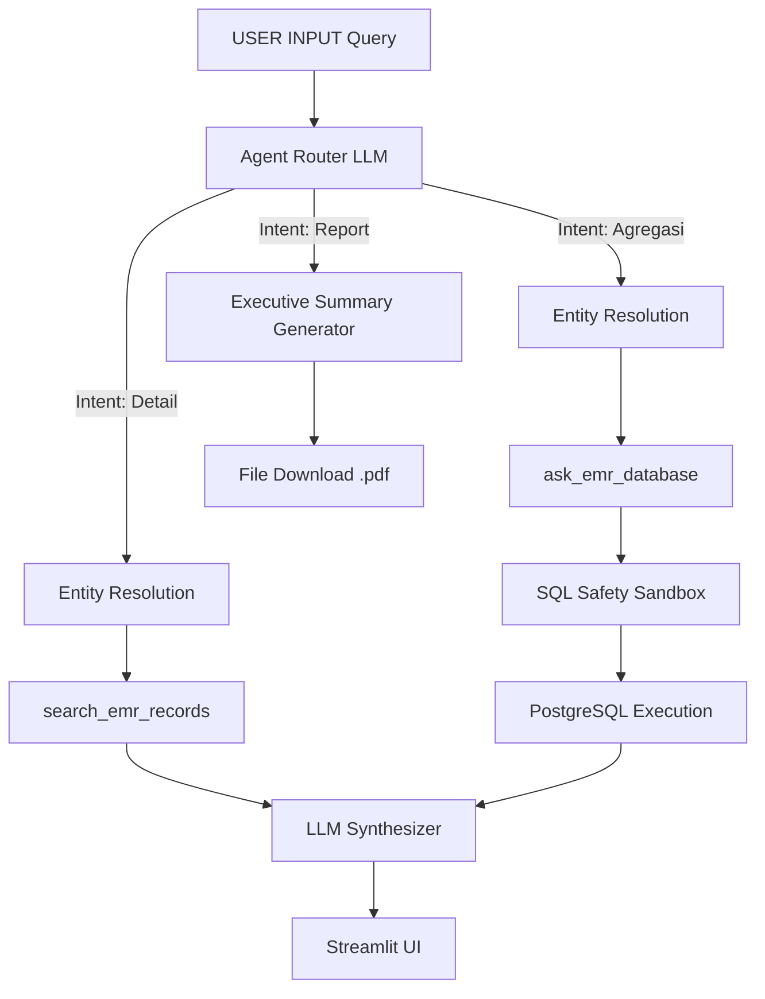

# EMR Fault Analyzer (Hybrid GraphRAG + SQL)

Proyek ini adalah sistem AI Assistant production-grade berbasis Hybrid GraphRAG dan SQL untuk menganalisis data Equipment Maintenance Records (EMR) alat berat. Arsitektur ini menggabungkan pencarian semantik kualitatif pada Knowledge Graph (Neo4j) dengan kemampuan agregasi data kuantitatif pada Relational Database (PostgreSQL) menggunakan LLM dan generator Text-to-SQL (Vanna AI).

---

## Arsitektur Sistem

Sistem ini dibangun menggunakan komponen utama sebagai berikut:
- **LLM Inference & Embedding**: Azure OpenAI API (GPT-5.4-mini & Text-Embedding-3-Small).
- **Knowledge Graph**: Neo4j (dengan plugin Graph Data Science (GDS) dan APOC untuk klasterisasi Leiden).
- **Relational Database**: PostgreSQL (menyimpan data log transaksional EMR untuk agregasi cepat).
- **SQL Generator**: Vanna AI (Text-to-SQL engine yang dilatih menggunakan skema DDL EMR).
- **Backend API**: FastAPI (dilengkapi fitur Circuit Breaker dan pengamanan API Key).
- **Frontend UI**: Streamlit Dashboard.

---

## Alur Data End-to-End (Data Flow)

Alur berikut menggambarkan perjalanan kueri pengguna dari input hingga menghasilkan jawaban akhir:

1. **User Input**: Pengguna memasukkan pertanyaan bebas pada Streamlit UI (contoh: *"Berapa kali model PC200 mengalami kebocoran oli di sistem hidrolik?"*).
2. **Intent Routing**: Kueri dikirim ke FastAPI backend. LLM akan melakukan klasifikasi intent untuk menentukan jenis pencarian:
   - **Kualitatif/Detail**: Menanyakan detail kronologi kasus spesifik.
   - **Kuantitatif/Analitis**: Menanyakan perhitungan angka, tren, atau statistik.
   - **Laporan Eksekutif**: Meminta ringkasan eksekutif dalam bentuk dokumen PDF.
3. **Entity Resolution (Penyelarasan Entitas)**:
   - *Bahasa Sederhana*: Proses ini bertindak seperti kamus pintar. Ketika pengguna mengetik kata bebas (misal: "rembes oli", "PC200-8"), sistem akan mencari nama resmi komponen/model yang terdaftar di database graf (misal: "Hydraulic Leak", "PC200-8").
   - *Proses Teknis*: Sistem mengekstrak kata kunci menggunakan LLM, mencocokkannya ke database Neo4j dengan Fulltext Search, dan melakukan fallback ke Vector Similarity Search jika tidak ada kecocokan teks mentah. Proses ini mengembalikan nama resmi (*Canonical Name*) dan ID Komunitas semantik (`community_id`).
4. **Eksekusi Pipeline**:
   - **Jalur Kualitatif (Neo4j)**: `EntityResolver` menelusuri hubungan antarnode graf (*graph traversal*) untuk menarik maksimal 5 record `EMRRecord` yang paling relevan dengan entitas pengguna.
   - **Jalur Kuantitatif (PostgreSQL)**: Kueri diteruskan ke Vanna AI bersama petunjuk (*hint*) `community_id`. Vanna menghasilkan syntax SQL PostgreSQL. Syntax tersebut disaring oleh SQL Sandbox untuk mencegah serangan injeksi. Jika query menghasilkan 0 baris, sistem beralih ke pencarian teks mentah menggunakan klausa `ILIKE`.
5. **Synthesis & Provenance**: LLM menggabungkan hasil data graf atau data SQL, merumuskan jawaban naratif, dan wajib melampirkan metadata bukti asal data (*Provenance*) di bawah pembatas `--- EVIDENCE/PROVENANCE ---` (menampilkan ID Komunitas atau ID EMR asal).
6. **UI Rendering**: Streamlit membagi teks jawaban berdasarkan pembatas. Jawaban utama ditampilkan secara interaktif, sementara data bukti (*provenance*) diletakkan di dalam menu drop-down kolaps agar tampilan tetap bersih.

### Flowchart Alur End-to-End



---

## Dokumentasi Fitur Detail

Detail implementasi kodingan untuk setiap modul teknis dipisahkan ke dalam folder dokumentasi terpusat di bawah ini:

- **[Fitur 1: search_emr_records](./docs/features/feature_search_emr.md)**: Fitur untuk mencari dan menampilkan detail lengkap hingga 5 dokumen EMR berdasarkan kata kunci kerusakan melalui mekanisme graph traversal Neo4j dari entitas yang berhasil di-resolve, lengkap dengan fallback stop-words dan pencarian model alat berat.
- **[Fitur 2: ask_emr_database](./docs/features/feature_ask_emr_db.md)**: Fitur untuk menghitung angka (agregasi) seperti total kerusakan atau tren bulanan dari database yang dijalankan lewat Text-to-SQL generator Vanna AI, disaring oleh SQL Sandbox untuk keamanan kueri, dan disinkronkan menggunakan parameter klaster `community_id`.
- **[Fitur 3: Entity Resolution Service](./docs/features/feature_entity_resolution.md)**: Fitur yang bertugas merapikan kueri input kotor dari pengguna menjadi nama resmi database (canonical name) melalui pencarian kecocokan entitas secara runtime menggunakan indexing Fulltext dan Vector Similarity di Neo4j.
- **[Fitur 4: Graph↔SQL Sync](./docs/features/feature_graph_sql_sync.md)**: Fitur penyinkron data agar data di database graf Neo4j selalu selaras dengan Relational Database PostgreSQL menggunakan metode sinkronisasi dua arah secara batch dengan operator UNWIND dan transaksi PostgreSQL.
- **[Fitur 5: Graph Extraction Pipeline](./docs/features/feature_graph_extraction.md)**: Fitur pengimpor awal yang membaca dokumen CSV mentah dan membangun jaringan graf Neo4j secara otomatis melalui pipeline ekstraksi relasi entitas bertahap menggunakan LLM Azure OpenAI dengan pengamanan rate-limit.
- **[Fitur 6: Community Pipeline](./docs/features/feature_community_pipeline.md)**: Fitur pengelompokan yang menyatukan gejala-gejala kerusakan sejenis ke dalam klaster besar menggunakan algoritma Leiden dari Neo4j Graph Data Science (GDS) dan diringkas secara paralel menggunakan LLM.
- **[Fitur 7: GraphRAG Retrieval](./docs/features/feature_graphrag_retrieval.md)**: Metode pencarian data pendukung untuk LLM yang mengekstraksi konteks semantik dari database graf melalui teknik pencarian Local (1-hop), Global (community summary), dan DRIFT (multi-hop traversal dinamis).
- **[Fitur 8: Agent Routing](./docs/features/feature_agent_routing.md)**: Pengendali kueri pengguna yang bertugas menebak arah kebutuhan informasi (kuantitatif, kualitatif, atau dokumen laporan) menggunakan intent classifier berbasis analisis prompt instruksi LLM untuk menentukan pemanggilan tool API secara dinamis.
- **[Panduan Pengujian Sistem (Testing Suite)](./tests/README.md)**: Kumpulan skenario pengujian unit terstruktur menggunakan framework `unittest` Python yang diiris per kategori fitur untuk menjamin stabilitas kode sebelum dideploy ke production.

---

## Panduan Menjalankan Aplikasi

Ikuti instruksi di bawah ini untuk memasang dan menjalankan aplikasi dari awal sampai akhir.

### Langkah 1: Persiapan Environment
1. Salin template konfigurasi variabel lingkungan:
   ```bash
   cp .env.example .env
   ```
2. Buka file `.env` dan isi nilai yang valid, khususnya kunci Azure OpenAI API, alamat endpoint, dan kata sandi database Anda.

### Langkah 2: Instalasi Dependensi
1. Buat virtual environment Python:
   ```bash
   python -m venv venv
   ```
2. Aktifkan virtual environment:
   - Windows (PowerShell):
     ```powershell
     .\venv\Scripts\Activate.ps1
     ```
   - Linux / macOS:
     ```bash
     source venv/bin/activate
     ```
3. Pasang library Python:
   ```bash
   pip install -r requirements.txt
   ```

### Langkah 3: Menjalankan Infrastruktur Database
Jalankan instansi Neo4j dan PostgreSQL menggunakan Docker Compose:
```bash
cd docker
docker compose up -d
cd ..
```
*Catatan: Pastikan plugin GDS (Graph Data Science) dan APOC telah diaktifkan pada instansi Neo4j.*

### Langkah 4: Eksekusi Ingestion Pipeline
Jalankan file Jupyter Notebook di dalam folder `notebook/` secara berurutan untuk memproses data mentah ke database:
1. **`1_sql_ingestion.ipynb`**: Memuat data mentah EMR ke PostgreSQL.
2. **`2_graph_extraction.ipynb`**: Mengekstrak entitas semantik ke Neo4j.
3. **`3_entity_resolution.ipynb`**: Membuat indeks pencarian vector dan fulltext.
4. **`4_community_pipeline.ipynb`**: Menjalankan deteksi Leiden dan rangkuman LLM.
5. **`5_graph_to_sql_sync.ipynb`**: Sinkronisasi awal parameter `community_id` ke SQL.
6. **`6_vanna_training.ipynb`**: Melatih mesin Text-to-SQL Vanna AI.

### Langkah 5: Menjalankan Backend dan Frontend
1. Jalankan server FastAPI backend:
   ```bash
   uvicorn src.main:app --reload
   ```
2. Pada terminal baru, jalankan Streamlit frontend:
   ```bash
   streamlit run src/streamlit_app.py
   ```
3. Buka peramban web dan akses dashboard pada alamat `http://localhost:8501`.
