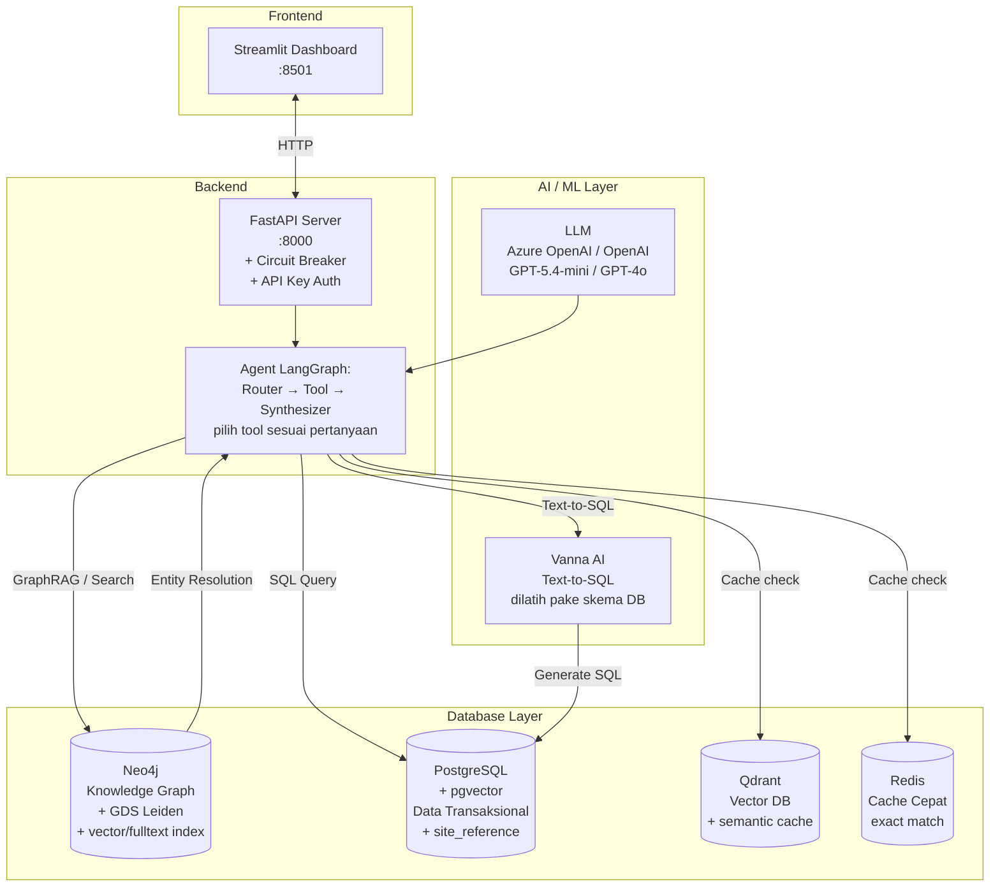

# EMR Fault Analyzer (Hybrid GraphRAG + SQL)

Sistem AI **all-in-one** buat analisis data perawatan alat berat (EMR). Bayangin kamu punya 20.000+ record kerusakan alat berat. Mau tanya: *"Hydraulic leak paling sering muncul di SMR berapa?"* atau *"Apa penyebab engine overheat di PC200?"* — semua bisa dijawab pake bahasa Indonesia biasa.

## Daftar Isi

- [Arsitektur Sistem](#arsitektur-sistem)
- [Alur Data End-to-End](#alur-data-end-to-end)
- [Komponen Detail](#komponen-detail)
- [Prasyarat](#prasyarat)
- [Panduan Menjalankan Aplikasi](#panduan-menjalankan-aplikasi)
- [Perintah Penting](#perintah-penting)
- [Dokumentasi Fitur Detail](#dokumentasi-fitur-detail)

---

## Arsitektur Sistem

Bayangin arsitektur ini kayak **dapur restoran** — ada beberapa bagian yang kerja bareng biar bisa ngasilin jawaban buat kamu.



### Penjelasan Arsitektur Sederhana

Dari kiri ke kanan:

| Layer | Isinya | Tugasnya |
|-------|--------|----------|
| **Frontend** | Streamlit di `:8501` | Tampilan chat + scatter plot SMR. Kamu ngetik, dia nampilin jawaban. |
| **Backend** | FastAPI (`:8000`) + Agent LangGraph | Otak utama. Nerima pertanyaan, milih tool yang tepat, nyusun jawaban. |
| **Database** | Neo4j + PostgreSQL + Qdrant + Redis | Nyimpen data. Graf buat hubungan, SQL buat angka-angka, Qdrant+Redis buat cache. |
| **AI** | LLM + Vanna | "Otak pembantu". LLM buat nulis jawaban, Vanna buat bikin SQL dari bahasa biasa. |

---

## Alur Data End-to-End

Ini cerita lengkapnya: dari kamu ngetik pertanyaan, sampe dapet jawaban.

### Langkah 1 — Kamu Ngetik Pertanyaan

Di dashboard Streamlit, kamu ngetik sesuatu kayak:
- *"Berapa total hydraulic leak di tahun 2025?"*
- *"Kenapa engine overheat sering terjadi di PC200?"*
- *"Hydraulic leak di site Bengalon + SMR scatter plot"*

### Langkah 2 — Router milih Tool

Backend nerima pertanyaan kamu, trus **LLM Router** baca dan mutusin:

| Kamu nanya... | Router milih... | Karena... |
|---------------|----------------|-----------|
| "Berapa total..." | `ask_emr_database` | Minta angka/statistik |
| "Kenapa / apa penyebab..." | `ask_emr_graph` | Minta penjelasan |
| "Cari EMR tentang..." | `search_emr_records` | Minta detail record |
| "SMR scatter plot..." | `analyze_smr` | Minta data grafik |
| "Buat laporan PDF..." | `generate_executive_summary` | Minta dokumen |

> 🧠 **Untuk junior:** Router ini pake AI juga, jadi kadang hasilnya bisa beda-beda. Makanya penting buat milih kata kunci yang tepat. Misal: daripada "masalah hydraulic" (ambigu), lebih baik "hitung hydraulic leak" (pasti ke DB) atau "penyebab hydraulic leak" (pasti ke Graph).

### Langkah 3 — Entity Resolution + Site Mapping

Sebelum tool dijalankan, sistem **nerjemahin dulu kata-kata kamu** ke bahasa database.

```
"oli bocor di PC200 site Jembayan"
         ↓
    EntityResolver: "oli bocor" → "OIL LEAK" (canonical name)
                  + community_ids: ["1258", "907", "945"]
                  + expanded_names: ["OIL LEAK", "Hydraulic Oil Leaks", ...]
    SiteMapper: "Jembayan" → "JBY"
```

Apa yang terjadi:
1. **EntityResolver** — nyari kata kunci teknis (symptom, model, component) di Neo4j, dapetin nama resmi + community_id
2. **Synonym Expansion** — dari community_id, nyari SEMUA entity lain dalam komunitas yang sama (biar pencarian lebih luas)
3. **SiteMapper** — deteksi nama site (Jembayan → JBY), inject filter `branch_site = 'JBY'`
4. Kalau ada **site + masalah** → community_id di-skip (biar gak terlalu sempit)

### Langkah 4 — Eksekusi Tool

Setiap tool jalan dengan caranya masing-masing:

**`ask_emr_database` (angka/statistik):**
```
Query + hint → Vanna AI generate SQL → SQL Sandbox (cek keamanan) 
→ Inject community_id filter + LIMIT 100 → PostgreSQL → Hasil
→ Kalau 0: fallback ILIKE pake expanded_names
```

**`ask_emr_graph` (penjelasan/penyebab):**
```
Query → GraphRAG Retriever (Local/Global/Hybrid/DRIFT) 
→ Cari konteks di Neo4j → Kirim konteks ke LLM → Jawaban naratif
```

**`search_emr_records` (detail EMR):**
```
Query → EntityResolver cari entity → Traversal graf cari EMRRecord 
→ Ambil 5 record → Enrichment dari PostgreSQL (SMR, site, dll)
→ Format Markdown
```

**`analyze_smr` (scatter plot SMR):**
```
Query → EntityResolver + SiteMapper → SQL LANGSUNG (bukan Vanna)
→ Query semua SMR (TANPA LIMIT) → Return smr_data[] → Streamlit render scatter plot
```

**`generate_executive_summary` (laporan PDF):**
```
Query → Kumpulin data dari semua tool → Generate PDF → Download
```

### Langkah 5 — Synthesizer + Provenance

LLM nulis jawaban dengan aturan:
1. Jawab pertanyaan dalam bahasa Indonesia yang jelas
2. Cantumin `--- EVIDENCE/PROVENANCE ---` di bagian bawah
3. Sebutin sumber data (record ID, community ID)

### Langkah 6 — Tampilan di Streamlit

Streamlit nampilin jawaban. Bagian provenance otomatis disembunyiin di dropdown biar tampilan tetap rapi.

### Flowchart End-to-End

```mermaid
graph TD
    A[Kamu ngetik pertanyaan\ndi Streamlit UI] --> B[FastAPI backend\n:8000]
    B --> C[Agent Router LLM\nbaca intent]
    
    C --> D{Ini pertanyaan\njenis apa?}
    
    D -->|Angka / Total| E[ask_emr_database]
    D -->|Penyebab / Solusi| F[ask_emr_graph]
    D -->|Cari EMR detail| G[search_emr_records]
    D -->|SMR / Scatter plot| H[analyze_smr]
    D -->|Buat laporan PDF| I[generate_executive_summary]
    
    E --> J[EntityResolver\ncari community_id\n+ nama canon]
    J --> K[SEMUA tool:\nResolve Site?]
    
    K --> L[Inject filter:\ncommunity_id / ILIKE / site]
    
    E --> M[Vanna AI bikin SQL]
    M --> N[SQL Sandbox\ncek keamanan]
    N --> O[Jalanin SQL + LIMIT]
    O --> P{Kalau 0?\nFallback ILIKE}
    
    F --> Q[GraphRAG: Local /\nGlobal / Hybrid / DRIFT]
    Q --> R[Konteks dari Neo4j]
    
    G --> S[Traversal graf\nAmbil 5 record]
    S --> T[Enrichment\ndari PostgreSQL]
    
    H --> U[SQL LANGSUNG\n(SQLAlchemy)\nTANPA LIMIT]
    U --> V[smr_data[]\nbuat scatter plot]
    
    I --> W[Kumpulin data\ndari semua sumber]
    W --> X[Generate PDF]
    
    R --> Y[LLM Synthesizer\n+ Provenance]
    P --> Y
    T --> Y
    V --> Y
    X --> Y
    
    Y --> Z[Streamlit render\njawaban + scatter plot\n+ provenance di dropdown]
```

---

## Komponen Detail

### 1. LLM & Embedding

| Provider | Model | Dipake buat |
|----------|-------|-------------|
| Azure OpenAI (utama) | GPT-5.4-mini | Nulis jawaban, routing, dll |
| Azure OpenAI (failover) | GPT-5.4-mini (cadangan) | Kalau primary error |
| OpenAI (fallback) | GPT-4o / GPT-4o-mini | Kalau Azure error semua |
| Embedding | text-embedding-3-small | Ubah teks ke vector |

Config: `src/config.py` — semua diatur lewat `.env`

### 2. Database

| Database | Isi | Cara Akses |
|----------|-----|-----------|
| **Neo4j** (Graf) | Graph knowledge: symptom, komponen, model, dll | Langgraph traversal + GDS Leiden |
| **PostgreSQL** (SQL) | Data transaksional: 20.630 record + SMR + site | Vanna AI + SQLAlchemy |
| **Qdrant** (Vector) | Cache semantic + embedding | Vector search |
| **Redis** | Cache exact match | Key-value cepat |

### 3. Agent Tools

| Tool | Dipanggil | Output |
|------|-----------|--------|
| `ask_emr_graph` | Pertanyaan "kenapa/gimana" | Jawaban naratif + konteks graf |
| `ask_emr_database` | Pertanyaan "berapa/total" | Tabel + SQL + metadata |
| `search_emr_records` | "Cari EMR tentang..." | 5 record detail |
| `analyze_smr` | "... + SMR/scatter" | smr_data[] buat plot |
| `generate_executive_summary` | "Buat laporan PDF" | File PDF |

### 4. Service Layer

| Service | File | Tugas |
|---------|------|-------|
| EntityResolver | `src/services/entity_resolver.py` | Terjemahin kata → entity teknis |
| SiteMapper | `src/services/site_map.py` | Deteksi nama site (Jembayan → JBY) |
| Circuit Breaker | `src/services/resilience.py` | Proteksi dari error beruntun |
| Cache | `src/services/cache_service.py` | Simpen jawaban biar cepet |
| Provider | `src/services/providers.py` | Koneksi ke database + LLM |

### 5. Keamanan

- **SQL Sandbox** — cuma SELECT/WITH yang boleh lewat
- **API Key** — wajib di staging/production (header `X-API-Key`)
- **Circuit Breaker** — proteksi dari server error 5xx
- **Read-only DB user** — Vanna cuma pake koneksi read-only

---

## Prasyarat

Sebelum mulai, pastikan kamu punya:

### Wajib
- **Python 3.10+** — buat backend + frontend
- **Docker Desktop** — buat jalanin Neo4j, PostgreSQL, Qdrant, Redis
- **8GB RAM minimal** — karena ada 4 containers + Python apps
- **Koneksi internet** — buat panggil Azure OpenAI / OpenAI API

### API Keys
Daftar ke provider AI dan dapetin key:
1. **Azure OpenAI** (recommended) — endpoint + api key + deployment names
2. **Atau OpenAI biasa** — api key + model name

### Software yang Harus Di-install
- Python 3.10+
- Docker Desktop
- Git
- (Opsional) Neo4j Desktop buat debugging

---

## Panduan Menjalankan Aplikasi

Ikuti langkah-langkah ini urut dari awal. Jangan ada yang dilewatin ya!

### Tahap 0 — Clone Repository

```bash
git clone <url-repo>
cd local-rag-comparator
```

### Tahap 1 — Setup Environment Variable

```bash
# 1. Copy template .env
cp .env.example .env

# 2. Edit .env — isi nilai yang bener
#    Minimal yang harus diisi:
#    - AZURE_OPENAI_ENDPOINT=...
#    - AZURE_OPENAI_API_KEY=...
#    - POSTGRES_URL=...
#    - NEO4J_PASSWORD=...
#    (atau pake OpenAI: OPENAI_API_KEY=...)
```

> ⚠️ **File `.env` isinya credentials asli.** Jangan di-commit ke Git! File `.env.example` aja yang boleh di-commit (udah dikosongin).

### Tahap 2 — Setup Python Environment

```bash
# 1. Buat virtual environment
python -m venv venv

# 2. Aktifkan
#    Windows PowerShell:
.\venv\Scripts\Activate.ps1

#    Linux/Mac:
source venv/bin/activate

# 3. Install library
pip install -r requirements.txt
```

### Tahap 3 — Jalankan Database (Docker)

```bash
# Masuk ke folder docker
cd docker

# Jalankan semua containers
docker compose up -d

# Kembali ke folder project
cd ..
```

Ini bakal jalanin 4 containers sekaligus:

| Container | Port | Butuh Waktu |
|-----------|------|-------------|
| Neo4j | 7687 (bolt), 7474 (browser) | ~30 detik |
| PostgreSQL | 5432 | ~10 detik |
| Qdrant | 6333 | ~10 detik |
| Redis | 6379 | ~5 detik |

> 🔍 **Cek status:** `docker compose ps` — pastikan semuanya `Up`

> ⚠️ **Neo4j plugins:** Pastikan `NEO4J_PLUGINS=["apoc","graph-data-science"]` udah ada di `docker/docker-compose.yml`. Kalau belum, tambahin.

### Tahap 4 — Setup Indeks & Lookup Tables

Sebelum ngisi data, kita perlu setup indeks dulu:

```bash
# 1. Setup indeks Neo4j (fulltext + vector)
python scripts/setup_indexes.py

# 2. Migrasi tabel site_lookup (55 data site)
python scripts/migrate_site_lookup.py
```

**Apa yang terjadi:**
- `setup_indexes.py` — bikin indeks pencarian di Neo4j biar EntityResolver bisa cari data dengan cepat
- `migrate_site_lookup.py` — bikin tabel `site_reference` di PostgreSQL dan ngisi 55 data site dari `data/plottingSite.csv`

### Tahap 5 — Data Ingestion Pipeline

Ini bagian yang **paling penting dan paling lama**. Kita ngisi database dengan 20.630 record EMR.

Jalanin notebook-notebook ini **berurutan** — jangan ada yang dilewatin:

```bash
# Buka folder notebook
cd notebook
```

| Urutan | Notebook | Fungsi | Estimasi Waktu |
|--------|----------|--------|---------------|
| **1** | `1_sql_ingestion.ipynb` | Muat CSV ke PostgreSQL | ~5 menit |
| **2** | `2_graph_extraction.ipynb` | Ekstrak entitas ke Neo4j (pake AI) | **~2-3 jam** ⏳ |
| **3** | `3_entity_resolution.ipynb` | Buat indeks pencarian | ~10 menit |
| **4** | `4_community_pipeline.ipynb` | Leiden clustering + summary | ~1 jam |
| **5** | `5_graph_to_sql_sync.ipynb` | Sync community_id ke PostgreSQL | ~5 menit |
| **6** | `6_vanna_training.ipynb` | Latih Vanna AI | ~10 menit |

> ⏳ **Notebook #2 paling lama** (2-3 jam) karena pake AI buat ekstrak entity. Kalau mati di tengah, ada mekanisme checkpoint — tinggal jalanin ulang, dia lanjut dari batch terakhir.

> ⏳ **Notebook #4 juga agak lama** karena harus nge-cluster 24.000+ komunitas dan bikin summary pake AI.

**Catatan tambahan:**
- **Notebook #5 — Sinkronisasi SMR.** Abis sync community_id, data SMR (`smr_trouble`) juga udah di-copy dari PostgreSQL ke Neo4j. Jadi scatter plot bisa jalan.
- **Notebook #6 — Training Vanna.** Vanna belajar dari:
  - `vanna_training/schema.sql` — struktur tabel
  - `vanna_training/qa_pairs.yaml` — contoh tanya-jawab
  - `vanna_training/domain_docs.md` — dokumentasi domain

### Tahap 6 — Jalankan Backend & Frontend

```bash
# Terminal 1: Backend FastAPI
uvicorn src.main:app --reload
# → http://localhost:8000

# Terminal 2: Frontend Streamlit (buka terminal baru)
streamlit run src/streamlit_app.py
# → http://localhost:8501
```

Kalau berhasil, kamu bakal liat:
- **Backend**: `INFO: Uvicorn running on http://localhost:8000`
- **Frontend**: `You can now view your Streamlit app at http://localhost:8501`

### Tahap 7 — Test Dengan Beberapa Pertanyaan

Coba tanya-tanya ini di dashboard Streamlit:

```
# Test statistik (ask_emr_database)
"Berapa total hydraulic leak?"
"Top 5 komponen paling sering rusak"

# Test penjelasan (ask_emr_graph)
"Kenapa engine overheat sering terjadi?"
"Apa penyebab final drive rusak?"

# Test SMR scatter (analyze_smr)
"Hydraulic leak di site Bengalon + SMR"
"Scatter plot SMR engine overheat"

# Test detail EMR (search_emr_records)
"Cari EMR tentang oli bocor"
"Detail EMR hydraulic leak di PC200"
```

---

## Perintah Penting

| Kategori | Perintah | Penjelasan |
|----------|----------|------------|
| **Jalanin backend** | `uvicorn src.main:app --reload` | Server API di `:8000` |
| **Jalanin frontend** | `streamlit run src/streamlit_app.py` | Dashboard di `:8501` |
| **Jalanin semua test** | `python -m unittest discover -s tests` | 6 file test |
| **Test 1 file** | `python -m unittest tests.test_agent_tools` | Test tool tertentu |
| **Sync graf → SQL** | `python scripts/sync_graph_to_sql.py [--dry-run]` | Sinkronisasi 2 arah |
| **Setup indeks Neo4j** | `python scripts/setup_indexes.py` | Fulltext + vector index |
| **Migrasi site** | `python scripts/migrate_site_lookup.py` | Tabel `site_reference` |
| **Jalanin evaluasi** | `python eval/run_eval.py` | Test golden QA dataset |
| **Aktifkan venv (Win)** | `.\venv\Scripts\Activate.ps1` | Masuk Python env |
| **Aktifkan venv (Linux)** | `source venv/bin/activate` | Masuk Python env |
| **Start Docker** | `cd docker; docker compose up -d; cd ..` | Jalanin 4 containers |
| **Stop Docker** | `cd docker; docker compose down; cd ..` | Matiin containers |

### Dry-Run Sync

Kalau mau cek apakah sync bakal ngubah data apa, pake `--dry-run`:

```bash
python scripts/sync_graph_to_sql.py --dry-run
```

Ini bakal ngeprint query yang bakal dijalanin, tapi gak beneran nge-eksekusi. Aman buat test.

---

## Struktur Folder (Yang Penting-Penting Aja)

```
local-rag-comparator/
├── src/                          # Kode utama
│   ├── main.py                   # FastAPI (endpoint /chat, /health, /cache)
│   ├── config.py                 # Semua config dari .env
│   ├── streamlit_app.py          # Frontend dashboard
│   ├── agent/
│   │   ├── agent.py              # LangGraph agent
│   │   ├── tools.py              # 5 tool utama
│   │   └── prompts.py            # Prompt untuk router + synthesizer
│   ├── services/
│   │   ├── entity_resolver.py    # Penterjemah kata → entity
│   │   ├── site_map.py           # Deteksi nama site
│   │   ├── resilience.py         # Circuit breaker
│   │   ├── cache_service.py      # Semantic + Redis cache
│   │   ├── providers.py          # Koneksi ke DB + LLM
│   │   └── embedding_service.py  # Ubah teks ke vector
│   ├── graph/
│   │   ├── client.py             # Koneksi Neo4j
│   │   ├── retrieval/            # Local, Global, Hybrid, DRIFT search
│   │   └── index_manager.py      # Indeks fulltext + vector
│   ├── ingestion/                # Pipeline ekstraksi CSV → Neo4j
│   └── community/                # Leiden clustering + summary
├── scripts/
│   ├── setup_indexes.py          # Setup indeks Neo4j
│   ├── migrate_site_lookup.py    # Migrasi tabel site_reference
│   ├── sync_graph_to_sql.py      # Sinkronisasi 2 arah
│   ├── migrate_smr.py            # Migrasi kolom smr_trouble
│   └── create_readonly_user.py   # User read-only buat Vanna
├── tests/                        # Unit test
│   ├── test_agent_tools.py       # Test SQL sandbox, LIMIT, provenance
│   ├── test_api_endpoints.py     # Test API routing
│   ├── test_resilience_circuit.py
│   ├── test_data_pipeline.py     # Test sync idempotency
│   ├── test_eval_utils.py        # Test atomic file writes
│   └── test_vanna_training.py    # Test training artifacts
├── vanna_training/               # Data training Vanna
│   ├── schema.sql                # DDL tabel
│   ├── qa_pairs.yaml             # Contoh tanya-jawab
│   └── domain_docs.md            # Dokumentasi domain
├── docker/
│   └── docker-compose.yml        # Infrastruktur (4 containers)
├── docs/features/                # Dokumentasi fitur (11 file)
│   ├── feature_agent_routing.md
│   ├── feature_ask_emr_db.md
│   ├── feature_entity_resolution.md
│   ├── feature_graphrag_retrieval.md
│   ├── feature_community_pipeline.md
│   ├── feature_graph_sql_sync.md
│   ├── feature_graph_extraction.md
│   ├── feature_search_emr.md
│   ├── feature_analyze_smr.md      # ➕ Baru
│   ├── feature_site_mapping.md     # ➕ Baru
│   └── feature_resilience.md       # ➕ Baru
├── eval/                          # Evaluasi model
│   ├── golden_qa.jsonl            # Dataset pertanyaan + jawaban
│   └── run_eval.py                # Script evaluasi
├── data/                          # Data mentah
│   ├── Dashboard EMR.csv          # 20.630 record EMR
│   └── plottingSite.csv           # 55 data site
├── .env                           # Credentials (jangan di-commit!)
├── .env.example                   # Template .env
├── AGENTS.md                      # Catatan internal developer
├── requirements.txt               # Library Python
└── README.md                      # File ini
```

---

## Troubleshooting (Yang Sering Salah)

| Masalah | Penyebab | Solusi |
|---------|----------|--------|
| Neo4j gak bisa connect | GDS/APOC gak aktif | Cek `NEO4J_PLUGINS` di docker-compose |
| Vanna SQL error | Training data rusak | Jalanin `test_vanna_training.py` |
| Sync 0 rows | `setup_indexes.py` belum dijalanin | Jalanin dulu baru sync |
| API 403 | `API_KEY` belum diset | Isi `API_KEY` di `.env` |
| Streamlit error "can't connect" | Backend belum jalan | Jalanin `uvicorn src.main:app --reload` dulu |
| Greenlet build error (Windows) | Versi greenlet salah | Pinned `greenlet>=3.0.0,<3.2.0` di requirements |
| Hasil query 0 terus | Community_id terlalu sempit | Coba pake query yang nyebut site (skip community_id) |

---

## Dokumentasi Fitur Detail

Penjelasan teknis yang lebih dalem buat masing-masing fitur ada di folder `docs/features/`:

| Fitur | File | Baca Kalau... |
|-------|------|---------------|
| Agent Routing | [`feature_agent_routing.md`](docs/features/feature_agent_routing.md) | Mau tau gimana sistem milih tool yang tepat |
| ask_emr_database | [`feature_ask_emr_db.md`](docs/features/feature_ask_emr_db.md) | Mau tau cara kerja SQL + Vanna |
| Entity Resolution | [`feature_entity_resolution.md`](docs/features/feature_entity_resolution.md) | Mau tau gimana sistem "ngerti" kata-kata kamu |
| GraphRAG Retrieval | [`feature_graphrag_retrieval.md`](docs/features/feature_graphrag_retrieval.md) | Mau tau 4 mode pencarian di graf |
| Community Pipeline | [`feature_community_pipeline.md`](docs/features/feature_community_pipeline.md) | Mau tau cara kerja Leiden clustering |
| Graph SQL Sync | [`feature_graph_sql_sync.md`](docs/features/feature_graph_sql_sync.md) | Mau tau gimana Neo4j ↔ PostgreSQL sinkron |
| Graph Extraction | [`feature_graph_extraction.md`](docs/features/feature_graph_extraction.md) | Mau tau gimana CSV jadi graf |
| search_emr_records | [`feature_search_emr.md`](docs/features/feature_search_emr.md) | Mau tau cara cari EMR detail |
| analyze_smr | [`feature_analyze_smr.md`](docs/features/feature_analyze_smr.md) | Mau tau cara scatter plot SMR |
| Site Mapping | [`feature_site_mapping.md`](docs/features/feature_site_mapping.md) | Mau tau gimana sistem deteksi nama site |
| Resilience | [`feature_resilience.md`](docs/features/feature_resilience.md) | Mau tau circuit breaker + caching |

---

## Evaluasi

Kita punya dataset emas (`eval/golden_qa.jsonl`) — 100+ pasangan pertanyaan + jawaban yang bener. Buat ngecek kualitas sistem:

```bash
python eval/run_eval.py
```

Hasilnya bakal keluar di `eval/results/` — liat skor akurasi, cakupan, dan metrik lainnya.
