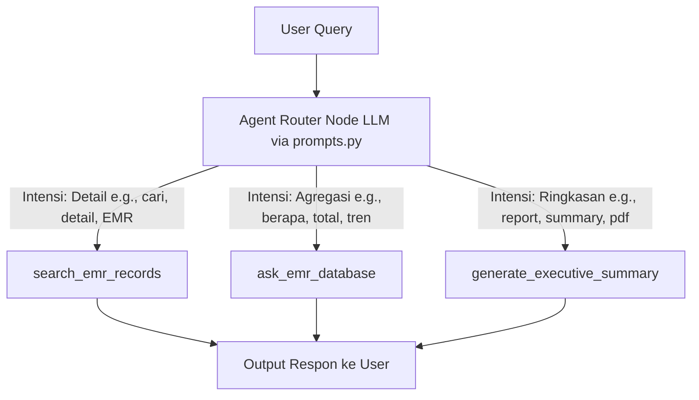

# Dokumentasi Fitur: Agent Routing

## Overview
Fitur `Agent Routing` bertindak sebagai sistem navigasi utama yang menentukan alur pemrosesan pertanyaan pengguna ke jalur yang paling tepat. Menggunakan instruksi dari LLM, *router* menganalisis kueri pengguna untuk menentukan apakah pertanyaan tersebut kualitatif (memerlukan detail rekam EMR spesifik via `search_emr_records`), kuantitatif (memerlukan agregasi data numerik/tren via `ask_emr_database`), atau memerlukan laporan ringkasan eksekutif (via `generate_executive_summary`).

## Flowchart



## Input → Process → Output
- **Input**: String pertanyaan dari pengguna (contoh: "Tunjukkan riwayat kerusakan final drive PC200").
- **Process**: Sistem mengirimkan kueri pengguna beserta daftar definisi tugas masing-masing *tool* ke LLM Router (`RAG_ROUTER_PROMPT`). LLM menganalisis isi kata kunci. Jika mendeteksi kebutuhan data mentah/detail spesifik, ia akan memilih `search_emr_records`. Jika mendeteksi kebutuhan komputasi/angka, ia memilih `ask_emr_database`. Jika meminta cetak PDF/laporan, ia memilih `generate_executive_summary`.
- **Output**: Objek keputusaan berupa nama *tool* yang harus dipanggil beserta parameter yang dibutuhkan.

## Kode Contoh
```python
# File: src/agent/agent.py

class EMRGraphRAGAgent:
    def process_request(self, user_query: str) -> dict:
        """
        Parameter:
          user_query (str): Pertanyaan bebas dari user.
        
        Return:
          dict: Output jawaban dari tool yang dieksekusi secara dinamis.
        """
        # Langkah 1: Tentukan rute menggunakan LLM Router
        route_decision = self.router.determine_route(user_query)
        tool_to_call = route_decision["tool"]
        
        # Langkah 2: Panggil tool yang dipilih
        if tool_to_call == "search_emr_records":
            response = self.tools.search_emr_records(user_query)
        elif tool_to_call == "ask_emr_database":
            response = self.tools.ask_emr_database(user_query)
        elif tool_to_call == "generate_executive_summary":
            response = self.tools.generate_executive_summary(user_query)
        else:
            response = "Maaf, jenis permintaan tidak dapat dikenali."
            
        return {"response": response, "tool_used": tool_to_call}
```

## Catatan Penting
- Akurasi *routing* sangat bergantung pada kejelasan definisi *keyword* di dalam prompt `RAG_ROUTER_PROMPT` (`src/agent/prompts.py`).
- Jika terjadi kegagalan pemanggilan alat (misalnya koneksi PostgreSQL terputus saat berada di jalur `ask_emr_database`), sistem akan dilindungi oleh *Circuit Breaker* untuk mencegah *crash* sistem secara keseluruhan.
- Perutean didesain agar bersifat *fail-safe*; jika LLM ragu-ragu memilih alat, sistem akan dialihkan secara default ke jalur `ask_emr_database` karena memiliki mekanisme pencarian *fallback ILIKE* yang luas.
