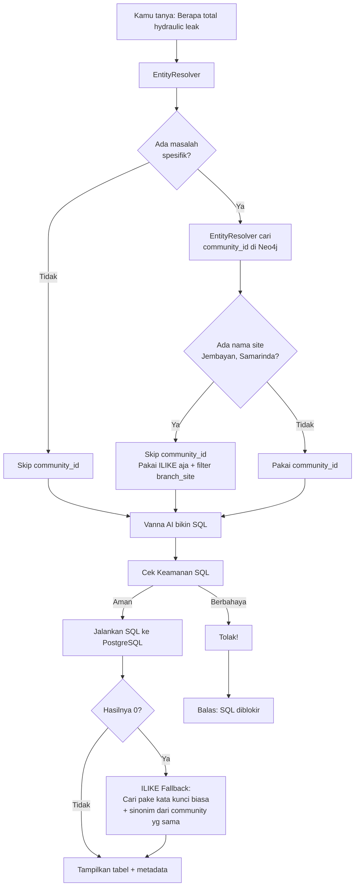

# Dokumentasi Fitur: ask_emr_database

## Apa yang Dilakukan Fitur Ini?

Fitur `ask_emr_database` adalah **pintu utama untuk bertanya soal angka dan statistik** ke database EMR.

Gunakan fitur ini kalau kamu mau tanya hal-hal seperti:
- *"Berapa total kerusakan engine overheat?"*
- *"Top 5 komponen yang paling sering rusak"*
- *"Tren kerusakan per bulan di tahun 2025"*
- *"Masalah apa yang sering terjadi di site Jembayan?"*
- *"Berapa banyak EMR untuk model PC200?"*

Fitur ini kerjanya: **mengubah pertanyaan bahasa Indonesia → SQL → menjalankan ke PostgreSQL → ngasih jawaban dalam bentuk tabel.**

## Alur Kerja (Flowchart)



## Input → Proses → Output

### Input
Pertanyaan bahasa Indonesia apa aja yang butuh angka, statistik, atau daftar.

Contoh:
- *"Total kerusakan hydraulic leak"*
- *"5 besar masalah di final drive"*
- *"Jumlah EMR per bulan"*

### Proses (Langkah demi Langkah)

**Langkah 1 — Cari Entity**
Pertanyaan kamu dikirim ke `EntityResolver`. Dia akan:
1. Minta LLM (AI) untuk **ekstrak kata kunci** dari pertanyaan (misal: "hydraulic leak" sebagai symptom)
2. Cocokin kata kunci itu ke database Neo4j pake **vector search + fulltext search**
3. Dapetin **canonical name** (nama resmi di database) dan **community_id**

**Langkah 2 — Cek Nama Site**
Sistem juga ngecek apakah kamu menyebut nama site (Jembayan, Samarinda, dll).
- Kalau **ada nama site** → community_id **DI-SKIP**. Kenapa? Karena community_id terlalu sempit kalau digabung filter site. Pakai ILIKE aja lebih akurat.
- Kalau **tidak ada nama site** → community_id dipakai untuk nyari data yang relevan di semua site.

**Langkah 3 — Vanna Bikin SQL**
Pertanyaan + petunjuk dikirim ke Vanna AI. Vanna akan generate SQL.
Petunjuknya tergantung situasi:
| Situasi | Petunjuk ke Vanna |
|---------|------------------|
| Ada site | "Gunakan filter: branch_site = 'JBY'. JANGAN pakai community_id." |
| Ada masalah, tanpa site | "Gunakan filter community_id: '1258' = ANY(community_id)" |
| Ada model aja | "JANGAN gunakan community_id — query ini murni filter model." |
| Gak ada entity | "JANGAN gunakan community_id." |

**Langkah 4 — Cek Keamanan SQL**
SQL dicek dulu:
- Harus `SELECT` atau `WITH` aja (gak boleh INSERT, DELETE, DROP, dll)
- Cuma 1 statement (gak boleh ada titik koma di tengah)
- Kalau berbahaya → ditolak

**Langkah 5 — Inject Filter**
Kalau pake community_id, sistem akan nambahin filter ke SQL:
```sql
-- SQL asli dari Vanna:
SELECT symptom, COUNT(*) FROM emr_records GROUP BY symptom

-- Setelah di-inject community_id:
SELECT symptom, COUNT(*) FROM emr_records 
WHERE ('1258' = ANY(community_id) OR '907' = ANY(community_id)) 
GROUP BY symptom
```

Kalau gak pake community_id (karena ada site), filter site ditambahin langsung:
```sql
SELECT symptom, COUNT(*) FROM emr_records 
WHERE branch_site = 'JBY' 
GROUP BY symptom
```

**Langkah 6 — Inject Limit**
Kalau SQL gak ada `LIMIT`, sistem otomatis nambah `LIMIT 100` biar gak overload.

**Langkah 7 — Jalanin SQL + Fallback**
SQL dijalankan ke PostgreSQL. Kalau hasilnya 0 (kosong):
1. Sistem coba lagi pake **ILIKE** (pencarian teks biasa)
2. Kata kunci yang dipakai = dari entity yg di-resolve + **sinonim** dari community yang sama
3. Contoh: "hydraulic oil leak" → "hydraulic", "oil", "leak" → juga "oil hydraulic leak", "hydraulic leaking"

### Output
```python
{
    "answer": "Teks jawaban dalam bahasa Indonesia + tabel markdown",
    "sql": "SELECT symptom, COUNT(*) FROM ...", 
    "sql_data": [{"symptom": "...", "count": 5}, ...],
    "resolved_entities": [{"mention": "hydraulic leak", "canonical_name": "HYDRAULIC OIL LEAK", ...}]
}
```

## Kode Contoh (Simplified)

```python
# File: src/agent/tools.py — fungsi ask_emr_database()

def ask_emr_database(query: str) -> dict:
    """
    1. EntityResolver → dapet community_id + canonical_name
    2. Cek apakah user nyebut nama site → resolve_site_mentions()
    3. Decision: pakai community_id atau ILIKE?
    4. Vanna generate SQL dari query + petunjuk
    5. Inject community_id filter (kalau perlu)
    6. Cek keamanan, inject LIMIT
    7. Jalanin SQL, kalau 0 → fallback ILIKE
    8. Return jawaban + data
    """
```

## Catatan Penting Buat Junior

1. **Community_id itu bukan synonym group.** Leiden clustering itu ngelompokin berdasarkan graph context (model + part + symptom), BUKAN berdasarkan kesamaan teks. Jadi jangan heran kalau "Hydraulic Oil Leaks" dan "Oil Hydraulic leaks" beda community.

2. **Kalau ada site, community_id di-skip.** Ini sengaja. Filter site + community_id itu terlalu sempit. Site + ILILE aja udah cukup spesifik.

3. **Synonym expansion ngebantu banget.** Setelah dapet community_id, sistem cari SEMUA entity dalam community yang sama. Jadi kalau user nyebut "hydraulic leak", sistem juga bakal nyari "Oil Hydraulic leaks", "Hydraulic pump leaks" — yang penting satu community.

4. **ILIKE fallback itu jaring pengaman.** Kalau community_id gagal (0 results), sistem gak nyerah — tetap nyoba pake pencarian teks biasa. Ini bikin fitur tetap jalan meskipun clustering-nya imperfect.

5. **SQL safety itu ketat.** Jangan khawatir soal SQL injection. Sistem udah punya `_is_safe_select_query()` yang ngeblok semua query berbahaya. Cuma SELECT yang boleh lewat.
