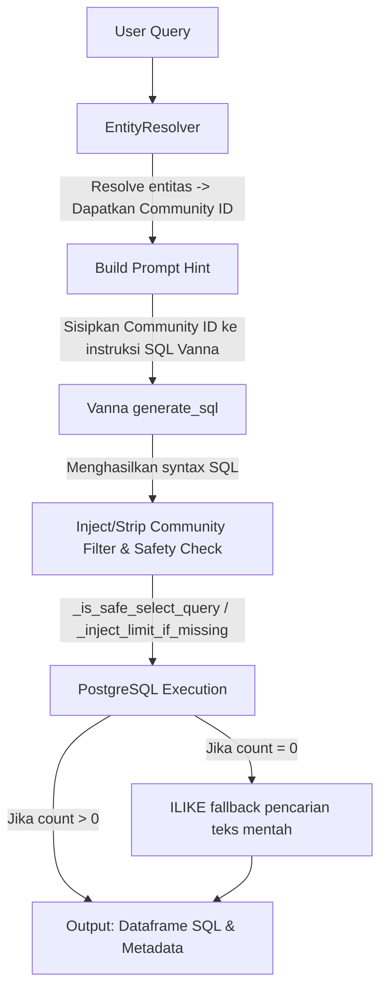

# Dokumentasi Fitur: ask_emr_database

## Overview
Fitur `ask_emr_database` adalah jembatan kuantitatif utama dalam sistem Hybrid RAG. Fitur ini menerima pertanyaan analitik dari pengguna (seperti tren, total, atau agregasi), menggunakan agen Vanna AI untuk menerjemahkan pertanyaan tersebut menjadi kueri SQL, dan mengeksekusinya di PostgreSQL. Untuk menjaga konsistensi dengan wawasan semantik graf, fitur ini menyuntikkan ID Komunitas (*community ID*) ke dalam SQL sebagai filter dasar sebelum eksekusi.

## Flowchart



## Input → Process → Output
- **Input**: `query` berupa string bahasa alami yang meminta penghitungan atau agregasi (contoh: "Berapa total masalah pada sistem hidrolik?").
- **Process**: Sistem meminta `EntityResolver` mencari ID Komunitas semantik dari kueri. Vanna men-generate SQL. Sistem memeriksa keamanan SQL (hanya diizinkan `SELECT`, tidak boleh operasi DML/DDL). Jika hasil eksekusi kosong (0 baris), sistem beralih ke pencarian *fallback* menggunakan klausa `ILIKE`. Terakhir, sistem menghitung total secara otomatis jika hasil kueri menyentuh batas LIMIT.
- **Output**: Dictionary berisi jawaban naratif LLM, *dataframe* hasil eksekusi SQL mentah, dan sintaks SQL yang digunakan.

## Kode Contoh
```python
# File: src/agent/tools.py

def ask_emr_database(query: str) -> dict:
    """
    Parameter:
      query (str): Pertanyaan perhitungan/agregasi dari user.
    
    Return:
      dict: Berisi 'answer' (teks LLM), 'sql' (sintaks SQL), 
            dan 'sql_data' (list of dict dari Dataframe).
    """
    community_id = EntityResolver().resolve_community_id(query)
    
    sql = vanna.generate_sql(query, hint=f"Gunakan WHERE community_id = {community_id}")
    
    if not _is_safe_select_query(sql):
        return {"answer": "Blocked unsafe query", "sql_data": None}
        
    sql = _inject_limit_if_missing(sql, limit=50)
    df = vanna.run_sql(sql)
    
    return {"answer": summarize(df), "sql_data": df.to_dict()}
```

## Catatan Penting
- Injeksi/filter `community_id` HANYA berlaku untuk pertanyaan berorientasi gejala (symptom) yang tidak menyertakan model spesifik.
- Sangat bergantung pada fungsi utilitas keamanan (`_is_safe_select_query`) untuk mencegah SQL Injection ke database EMR.
- Menyediakan *fallback* transparan menggunakan `ILIKE` jika penelusuran semantik Neo4j gagal memetakan entitas kueri.
