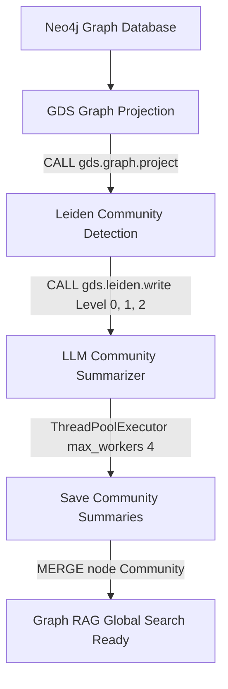

# Dokumentasi Fitur: Community Pipeline

## Overview
Fitur `Community Pipeline` dirancang untuk mengelompokkan jutaan entitas di database graf Neo4j ke dalam klaster semantik hierarkis, lalu membuat rangkuman otomatis untuk masing-masing klaster tersebut. Fitur ini menggunakan algoritma deteksi komunitas Leiden dari library Graph Data Science (GDS) Neo4j untuk menetapkan ID komunitas, lalu menggunakan LLM secara paralel untuk membuat deskripsi rangkuman dari masing-masing komunitas guna mendukung pencarian global (*Global Search*).

## Flowchart



## Input → Process → Output
- **Input**: Struktur graf Neo4j yang berisi entitas dan relasi yang belum terklaster.
- **Process**: Sistem memproyeksikan graf ke memori graf Neo4j GDS. Algoritma Leiden dijalankan untuk mempartisi node menjadi klaster hierarkis (Level 0, 1, 2) dan menyimpan `communityId` ke properti node. Selanjutnya, sistem mengumpulkan semua informasi entitas yang berada di bawah ID komunitas yang sama, mengirimkannya ke LLM menggunakan 4 *worker* secara paralel via `ThreadPoolExecutor` untuk dirangkum, dan menuliskan teks rangkuman tersebut kembali ke Neo4j sebagai node `Community`.
- **Output**: Node `Community` terisi dengan properti `summary` dan `communityId` di Neo4j.

## Kode Contoh
```python
# File: src/community/detection.py & summarization.py

class CommunityPipelineRunner:
    def execute(self) -> bool:
        """
        Parameter: None
        Return:
          bool: True jika projeksi graf, deteksi Leiden, dan rangkuman LLM berhasil dijalankan.
        """
        # 1. Jalankan deteksi Leiden via GDS
        detector = LeidenDetector(graph_client)
        detector.run_leiden_detection()
        
        # 2. Rangkum komunitas menggunakan parallel worker
        summarizer = CommunitySummarizer(graph_client, llm_client)
        summarizer.summarize_all(max_workers=4)
        
        return True
```

## Catatan Penting
- Modul ini mutlak memerlukan plugin **Neo4j Graph Data Science (GDS)** dan **APOC** yang aktif pada instansi Neo4j.
- Penggunaan `max_workers=4` pada LLM Summarizer sangat membantu memangkas waktu pemrosesan ratusan kelompok komunitas Level 0 tanpa memicu batas kuota API secara berlebihan.
- Komunitas Level 0 adalah tingkat klaster semantik terkecil yang diekspor dan dicocokkan ke database PostgreSQL untuk sinkronisasi.
