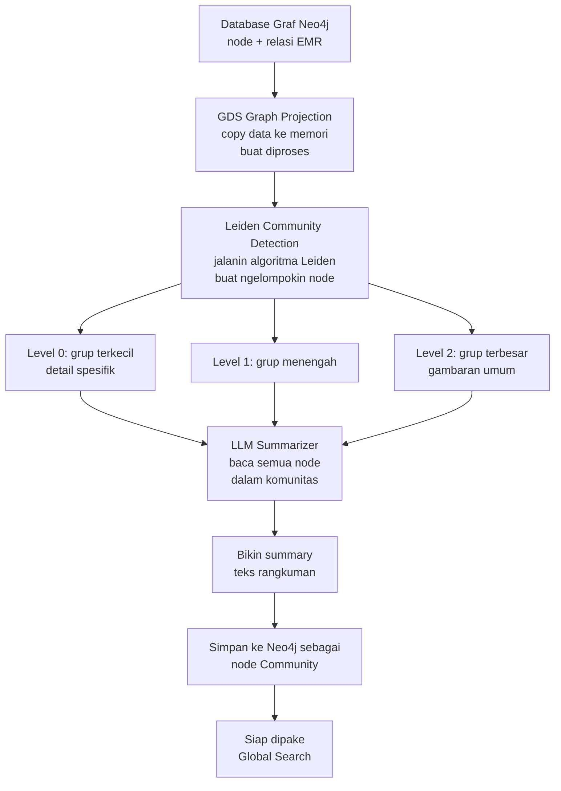

# Dokumentasi Fitur: Community Pipeline

## Apa yang Dilakukan Fitur Ini?

Fitur ini tugasnya **ngelompokin data-data di Neo4j ke dalam grup (komunitas)**, trus bikin rangkuman buat masing-masing grup.

Kenapa perlu dikelompokin? Bayangin kamu punya 20.000+ record EMR. Masing-masing record nyambung ke symptom, komponen, model, dll. Nah, beberapa data ini punya **pola yang mirip** (misal: semua engine overheat di model PC200). Community Pipeline bakal ngelompokin yang mirip-mirip jadi satu grup.

Hasil grup ini dipake buat **Global Search** — jadi kalau user nanya "Apa tren kerusakan engine?", sistem tinggal baca rangkuman grupnya, gak perlu baca satu-satu.

## Alur Kerja (Flowchart)



## Parameter Leiden Clustering

| Parameter | Nilai | Artinya |
|-----------|-------|---------|
| `gamma` | 1.0 | Seberapa detail grupnya. Makin kecil → makin banyak grup kecil. Default 1.0. |
| `theta` | 0.01 | Threshold resolusi. Makin kecil → lebih sensitif. |
| `level` | 0, 1, 2 | Level hierarki. 0 = paling detail, 2 = paling umum. |

⚠️ **Yang dipake buat sync ke PostgreSQL cuma Level 0** — yang paling detail.

## Input → Proses → Output

### Input
Struktur graf Neo4j yang udah ada node dan relasi dari hasil ekstraksi.

### Proses

**Langkah 1 — Project Graph**
Semua data di Neo4j di-copy ke memori khusus GDS biar bisa diproses cepat.
```
CALL gds.graph.project('emr-leiden', '*', '*')
```

**Langkah 2 — Leiden Detection**
Algoritma Leiden jalan. Hasilnya: setiap node dapet `communityId` untuk Level 0, 1, dan 2.
```
CALL gds.leiden.write('emr-leiden', {writeProperty: 'communityId', ...})
```

**Langkah 3 — Bikin Summary**
Buat setiap grup (komunitas), sistem ngumpulin semua entity di dalemnya, trus dikirim ke LLM buat dirangkum. Proses ini paralel pake 4 worker biar cepet.

**Langkah 4 — Simpan ke Neo4j**
Rangkuman disimpen sebagai node `Community` baru di Neo4j.

### Output
Node `Community` di Neo4j dengan properti:
```
Community {
    communityId: 1258,
    level: 0,
    summary: "Komunitas ini berisi gejala-gejala terkait kebocoran oli ..."
}
```

## Kode Contoh (Simplified)

```python
# File: src/community/detection.py & summarization.py

class CommunityPipelineRunner:
    def execute(self) -> bool:
        # 1. Jalanin Leiden
        detector = LeidenDetector(graph_client)
        detector.run_leiden_detection()
        
        # 2. Rangkum pake 4 worker paralel
        summarizer = CommunitySummarizer(graph_client, llm_client)
        summarizer.summarize_all(max_workers=4)
        
        return True
```

## Catatan Penting untuk Pengembang Selanjutnya

1. **Community_id BUKAN synonym group.** Ini penting! Leiden clustering itu ngelompokin berdasarkan **graph proximity** — yaitu seberapa dekat hubungan node-node di dalam graf. Bukan berdasarkan kesamaan teks. Jadi "Hydraulic Oil Leaks" dan "Oil Hydraulic leaks" bisa beda komunitas.

2. **Level 0 dipake buat sync ke PostgreSQL.** Community_id Level 0 (yang paling detail) disalin ke tabel `emr_records` di PostgreSQL. Ini yang dipake buat filter di `ask_emr_database`.

3. **Gamma=1.0 menghasilkan ~24.000 komunitas** untuk 20.630 record. Ini normal buat modularity-based clustering.

4. **Butuh plugin GDS + APOC.** Pastikan Neo4j kamu udah install plugin `graph-data-science` dan `apoc`. Tanpa ini pipeline gak bisa jalan.

5. **max_workers=4 biar gak kena rate limit LLM.** Summarize 24.000 komunitas butuh waktu. Pake 4 thread paralel biar cepet tapi tetap aman dari batas kuota API.
