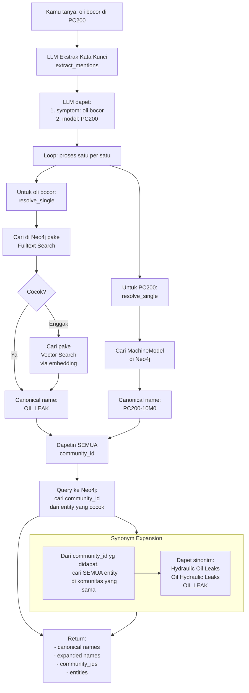

# Dokumentasi Fitur: Entity Resolution Service

## Apa yang Dilakukan Fitur Ini?

Entity Resolution adalah **jembatan antara bahasa kamu dengan database graf (Neo4j)**.

Masalahnya gini: di database, data EMR pake istilah-istilah baku (canonical names). Misalnya:
- Kamu bilang **"oli bocor"** → di database namanya **"OIL LEAK"**
- Kamu bilang **"mesin kepanasan"** → di database namanya **"ENGINE OVERHEAT"**
- Kamu bilang **"hidrolik bocor"** → di database namanya **"HYDRAULIC OIL LEAK"**

Nah, Entity Resolution ini tugasnya: **nerjemahin bahasa kamu ke bahasa database.**

## Alur Kerja (Flowchart)



## Input → Proses → Output

### Input
String pertanyaan dari kamu dalam bahasa Indonesia atau Inggris.

### Proses (Langkah demi Langkah)

**Langkah 1 — Ekstraksi Kata Kunci**
LLM (AI) baca pertanyaan kamu, trus ekstrak kata-kata yang penting.

Yang diekstrak:
| Tipe Entity | Contoh | Maksudnya |
|------------|--------|-----------|
| `symptom` | "oli bocor", "overheat", "hydraulic leak" | Gejala kerusakan |
| `model` | "PC200", "HD785", "D155A" | Nama model alat berat |
| `component` | "FINAL DRIVE", "engine", "transmission" | Nama komponen |
| `part` | "seal", "injector", "oring" | Nama part |
| `root_cause` | "kontaminasi", "aus", "salah setel" | Akar masalah |

⚠️ LLM sengaja **diinstruksikan untuk skip** kata-kata generik kayak "fault", "error", "problem", "data", "cari", "tolong" — karena kata-kata itu bukan entitas teknis.

**Langkah 2 — Pencarian di Neo4j**
Setiap kata kunci dicari di Neo4j dengan 2 cara:
1. **Fulltext Search** — cocokin kata persis (cepat, prioritized)
2. **Vector Search** — cocokin makna pake embedding (lambat tapi akurat buat sinonim)

Hasil dari kedua cara digabung, diurutkan berdasarkan skor kecocokan.

**Langkah 3 — Dapetin Canonical Name**
Dari hasil pencarian, diambil yang paling cocok → dapet **canonical name** (nama resmi).

Contoh:
| Kamu bilang | Canonical Name |
|------------|----------------|
| "oli bocor" | "OIL LEAK" |
| "mesin kepanasan" | "ENGINE OVERHEAT" |
| "PC200" | "PC200-10M0" |

**Langkah 4 — Dapetin Community ID**
Setiap canonical name punya community_id di Neo4j. Sistem ngambil **SEMUA** community_id yang terhubung ke entity itu (gak cuma 1).

Ini penting karena satu entity bisa ada di beberapa komunitas (misal "HYDRAULIC OIL LEAK" ada di 130+ komunitas, tergantung model alatnya).

**Langkah 5 — Synonym Expansion (Fitur Baru! 🔥)**
Setelah dapet community_id, sistem balik nanya ke Neo4j:
> "Di dalam komunitas ini, ada entity apa aja lagi?"

Hasilnya: dapet **nama-nama sinonim** — yaitu entity lain yang satu komunitas. Ini ngebantu banget buat nyari data yang lebih lengkap.

Contoh: user nyebut "hydraulic oil leak"
1. EntityResolver dapet canonical name: "HYDRAULIC OIL LEAK"
2. Dapet community_id: [1258, 907, 945, ...]
3. Synonym expansion: dapet "Oil Hydraulic leaks", "HYDRAULIC OIL LEAKS", "Hydraulic Pump Leaks Oil", dll
4. Nama-nama ini dipake di ILIKE fallback → hasil pencarian jadi lebih luas

### Output
```python
{
    "canonical_names": ["OIL LEAK", "PC200-10M0"],
    "expanded_names": ["OIL LEAK", "Oil Hydraulic Leaks", "OIL LEAKAGE", ...],  # ← sinonim!
    "community_ids": ["1258", "907", "945", ...],
    "symptom_community_ids": ["1258", "907", "945", ...],
    "entities": [
        {"mention": "oli bocor", "canonical_name": "OIL LEAK", "type": "symptom", "score": 0.95}
    ]
}
```

## Method Penting di EntityResolver

| Method | Fungsi | Dipanggil oleh |
|--------|--------|---------------|
| `resolve_query()` | Lengkap: ekstrak + resolve + modified query | `ask_emr_database`, `analyze_smr` |
| `resolve_mentions_to_community_ids()` | Dapetin semua community_id + expanded_names | `ask_emr_database`, `analyze_smr` |
| `resolve_community_ids()` | Cari semua community_id dari satu canonical name | Internal |
| `_expand_synonyms()` | Cari semua entity satu komunitas (sinonim) | Internal |
| `search_emr_records()` | Cari EMR record lewat graf Neo4j | `search_emr_records` tool |

## ⚡ Optimasi Baru: Skip EntityResolver Kalau Site/Account Sudah Ada

**Ini perubahan penting!** 

Di `ask_emr_database`, sebelum memanggil EntityResolver, sistem dulu cek:
```python
site_query, site_hint = resolve_site_mentions(query)
account_query, account_hint = resolve_account_mentions(query)

if site_hint or account_hint:
    # FAST PATH: SKIP EntityResolver (hemat 2 panggilan LLM + token)
    modified = f"Gunakan filter: {site_hint} AND {account_hint}. Gunakan ILIKE..."
else:
    # SLOW PATH: pake EntityResolver + community_id
    resolved = resolver.resolve_query(query)
    ...
```

**Alasannya:**
- Filter site (`branch_site = 'TRK'`) + ILIKE sudah cukup spesifik
- Filter account (`account_account_name = 'PAMAPERSADA NUSANTARA'`) + ILIKE sudah cukup spesifik
- Community_id cuma bikin pencarian terlalu sempit kalau digabung site/account
- Hemat ~5-10 detik + token LLM per query

## Catatan Penting untuk Pengembang Selanjutnya

1. **EntityResolver itu pake LLM untuk ekstrak kata kunci.** Jadi hasilnya kadang bisa beda-beda untuk pertanyaan yang mirip. Makanya kita pake prompt khusus (`EXTRACT_PROMPT`) yang udah di-tuning.

2. **Dulu community_id cuma dapet 1, sekarang dapet BANYAK.** Awalnya sistem cuma ngambil 1 community_id (pake `LIMIT 1`). Tapi itu terlalu sempit. Sekarang kita ambil semua community_id yang terhubung. Ini bikin pencarian jauh lebih luas.

3. **Synonym expansion itu baru.** Fitur ini nyari entity lain dalam komunitas yang sama. Contoh praktis: kalau kamu search "hydraulic leak", sistem juga bakal nyari "Oil Hydraulic leaks", "Hydraulic Oil Leaks", dll. Ini ngebantu banget buat dapetin data yang lebih lengkap.

4. **Ada brand map juga di `_build_modified_query()`.** Kalau kamu nyebut "Komatsu", sistem akan otomatis ganti jadi "KOMAT" (kode di database). Ini khusus buat brand.

5. **EntityResolver gak tau soal nama site.** Resolusi nama site (Jembayan → JBY) ditangani oleh modul terpisah: `site_map.py`. Ini sengaja dipisah biar tanggung jawabnya jelas.

6. **EntityResolver juga gak tau soal nama customer/account.** Resolusi nama account (PAMA → PAMAPERSADA NUSANTARA) ditangani oleh modul terpisah: `account_map.py`. Sama kayak site mapping, sengaja dipisah. Lihat [`feature_account_mapping.md`](feature_account_mapping.md).

7. **EntityResolver di-SKIP kalau site/account sudah ketemu.** Kalau pertanyaan "oil leak di Tarakan", sistem resolve site dulu → dapet `branch_site = 'TRK'` → **EntityResolver gak dipanggil**. Hemat ~5-10 detik + token LLM.
