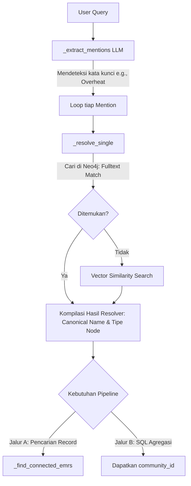

# Dokumentasi Fitur: Entity Resolution Service

## Overview
Layanan `Entity Resolution` adalah mesin penerjemah inti yang berjalan secara *runtime* untuk menjembatani bahasa alami dari pengguna ke dalam format entitas graf di Neo4j. Layanan ini mengekstrak kata kunci dari pertanyaan pengguna, menormalisasinya, lalu menggunakan pendekatan hibrida (Fulltext Search dan Vector Search) untuk menemukan Node persis (Canonical Name) dan ID Komunitas di dalam database graf.

## Flowchart



## Input → Process → Output
- **Input**: String kueri pengguna.
- **Process**: Sistem memanggil fungsi LLM di `prompts.py` untuk mengisolasi penyebutan entitas teknis (Mentions). Fungsi `_resolve_single()` kemudian memadankan teks bebas ini dengan entitas terdekat di Neo4j menggunakan indeks *Fulltext* atau *Vector Similarity*. Hasil pemadanan ini kemudian diteruskan untuk menemukan EMR yang terhubung langsung (`_find_connected_emrs` / `_search_emrs_by_model`) atau diekstrak `community_id`-nya untuk `ask_emr_database`.
- **Output**: Objek atau struktur data yang berisi *Canonical Name*, ID Node, tipe entitas, dan *Community ID*.

## Kode Contoh
```python
# File: src/services/entity_resolver.py

class EntityResolver:
    def resolve_query(self, query: str) -> list:
        """
        Parameter: query (str) bahasa alami.
        Return: List of dictionaries berisi entitas Neo4j yang tervalidasi.
        """
        mentions = self._extract_mentions(query)
        resolved_entities = []
        for m in mentions:
            entity = self._resolve_single(m)
            if entity:
                resolved_entities.append(entity)
        return resolved_entities

    def resolve_community_id(self, query: str) -> list:
        """
        Parameter: query (str).
        Return: List of integer (community ID Level 0).
        """
        entities = self.resolve_query(query)
        # Ekstrak community_id dari entities
        return [e["community_id"] for e in entities]
```

## Catatan Penting
- Resolusi sangat mengandalkan *prompt engineering* (`prompts.py`) untuk memisahkan instruksi pengguna dari entitas teknis alat berat (Entity Extraction).
- Proses ini cukup lambat jika mengandalkan *Vector Search* terus menerus, sehingga *Fulltext Search* harus dieksekusi pertama kali sebagai langkah prioritas.
- Layanan ini merupakan titik pusat kegagalan (Single Point of Failure) untuk akurasi kuantitatif; jika resolusi gagal, pencarian SQL akan meleset.
