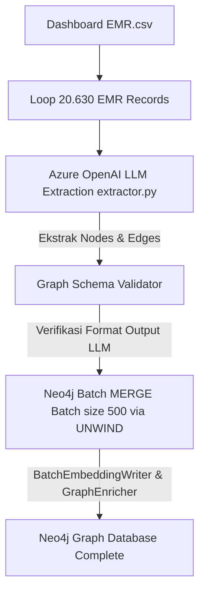

# Dokumentasi Fitur: Graph Extraction Pipeline

## Overview
Fitur `Graph Extraction Pipeline` bertanggung jawab untuk mengubah data rekam medis/perawatan alat berat (EMR) yang masih berformat CSV mentah menjadi struktur graf semantik yang saling terhubung di Neo4j. Proses ini membaca ribuan baris rekaman secara bertahap, mengekstrak entitas (SymptomPattern, Component, RootCausePattern, ActionPattern, Model) dan hubungan relasinya menggunakan LLM Azure OpenAI, lalu menyisipkannya menggunakan skema optimasi batch ke database Neo4j.

## Flowchart



## Input → Process → Output
- **Input**: File data mentah `Dashboard EMR.csv` berisi baris data perawatan alat berat.
- **Process**: Sistem memuat file CSV, membaginya menjadi partisi kecil untuk menghindari pemuatan memori berlebih. Setiap record dikirim ke Azure OpenAI untuk mendeteksi entitas dan relasi berdasarkan petunjuk ekstraksi. Hasil deteksi divalidasi, lalu di-MERGE ke Neo4j dalam batch berukuran 500 baris menggunakan query `UNWIND` teroptimasi untuk menghindari tabrakan kunci penulisan database (lock contention).
- **Output**: Kumpulan Node (EMRRecord, SymptomPattern, dll.) dan Edge relasi yang saling terhubung di Neo4j.

## Kode Contoh
```python
# File: src/ingestion/extractor.py

class GraphExtractor:
    def extract_and_ingest(self, csv_path: str, batch_size: int = 500) -> None:
        """
        Parameter:
          csv_path (str): Lokasi file CSV mentah EMR.
          batch_size (int): Jumlah baris yang diproses per batch.
        
        Return:
          None
        """
        df = pd.read_csv(csv_path)
        for i in range(0, len(df), batch_size):
            chunk = df.iloc[i : i + batch_size]
            extracted_data = self.llm_client.extract_entities_and_relations(chunk)
            self.graph_client.write_batch_unwind(extracted_data)
```

## Catatan Penting
- Pipeline ini berjalan secara berurutan (*sequential*) dan sangat dibatasi oleh kecepatan respon dan batas kuota (*rate-limit*) Azure OpenAI API.
- Proses ekstraksi untuk seluruh 20.630 data memerlukan waktu sekitar 2 hingga 3 jam, sehingga sistem membutuhkan mekanisme pencatatan riwayat kemajuan (*checkpointing*) agar proses dapat dilanjutkan jika terputus di tengah jalan.
