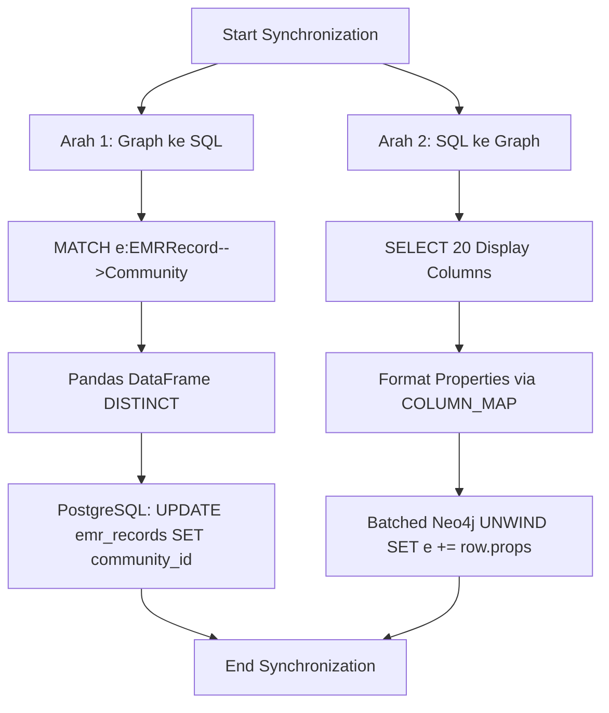

# Dokumentasi Fitur: Graph↔SQL Sync

## Overview
Fitur Sinkronisasi (Sync) memastikan bahwa data terstruktur di PostgreSQL (*Quantitative Data*) dan data semantik kualitatif di Neo4j (*Knowledge Graph*) tetap konsisten satu sama lain. Proses sinkronisasi ini berjalan secara *batch* dalam dua arah: menyalin tag komunitas (Semantic ID) dari graf ke SQL, dan menyalin metadata tampilan kolom EMR dari SQL kembali ke node-node graf di Neo4j.

## Flowchart



## Input → Process → Output
- **Input**: Konfigurasi koneksi dari `settings` (Neo4j Client dan SQLAlchemy Engine) dan *trigger* dari Notebook 5 atau scheduler CLI.
- **Process**: 
  1. **(Neo4j → PG)**: Mengekstrak semua relasi EMR ke Komunitas Level 0, menghapus duplikat melalui Pandas, lalu menyuntikkan ID komunitas tersebut ke kolom *array* `community_id` di PostgreSQL menggunakan tabel *temporary*.
  2. **(PG → Neo4j)**: Membaca 20 kolom metadata dari PostgreSQL (berdasarkan kamus `COLUMN_MAP`), membundel data dalam *batch* berisi 500 baris, lalu mengeksekusi operasi `UNWIND ... SET` di Neo4j untuk memperbarui node `EMRRecord`.
- **Output**: Data tersinkronisasi di kedua *database* tanpa mengembalikan objek ke *runtime* eksekutor (void return), dengan sifat *idempotent* (aman dijalankan berkali-kali).

## Kode Contoh
```python
# File: scripts/sync_graph_to_sql.py

def sync_community_id_to_postgres(neo4j_client, pg_uri, dry_run=False):
    """
    Parameter:
      neo4j_client: Instansiasi koneksi graf.
      pg_uri (str): URI koneksi PostgreSQL.
      dry_run (bool): Jika True, operasi DB diskip.
    Return: None
    """
    # 1. Fetch data dari graph (menggunakan relasi keluar universal '-->')
    # 2. Masukkan ke Pandas DataFrame
    # 3. Update PostgreSQL
    pass

def sync_display_cols_to_neo4j(neo4j_client, pg_uri, dry_run=False):
    """
    Menyalin nilai dari 20 kolom PG (berdasarkan COLUMN_MAP) 
    menjadi properti node EMRRecord di Neo4j menggunakan UNWIND batch.
    """
    pass
```

## Catatan Penting
- Script ini sangat rawan terhadap masalah performa (N+1 query) jika indeks relasional (seperti indeks pada `e.emr_name`) tidak disiapkan di Neo4j.
- Sinkronisasi *community_id* bergantung pada semua arah panah relasi (-->) agar tag dari Komponen dan Model Alat juga disalin, tidak hanya tag Gejala.
- Operasi tabel *temporary* di PostgreSQL dijalankan menggunakan sistem transaksi. Jika gagal di tengah proses, perubahan otomatis dibatalkan (*Rollback*).
