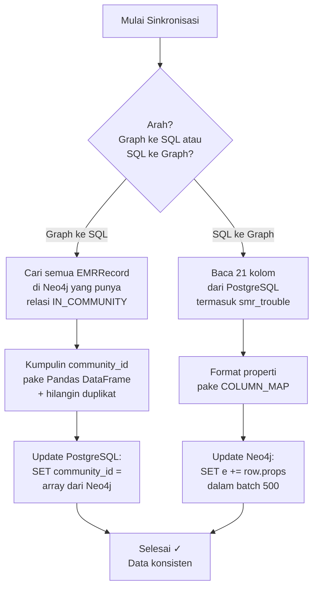

# Dokumentasi Fitur: Graph ↔ SQL Sync

## Apa yang Dilakukan Fitur Ini?

Fitur ini tugasnya **nyinkronin data antara Neo4j (graf) dan PostgreSQL (SQL)**.

Masalahnya: data EMR itu disimpen di 2 tempat:
1. **Neo4j** — nyimpen hubungan antar entitas (symptom, komponen, model, dll)
2. **PostgreSQL** — nyimpen data angka dan teks (SMR, part number, tanggal, dll)

Kedua database ini perlu **saling tahu** satu sama lain. Misal: 
- Neo4j butuh tau `smr_trouble` biar bisa ditampilkan di response
- PostgreSQL butuh tau `community_id` biar bisa filter pencarian

Nah, sync ini yang ngejembatani.

## Alur Kerja (Flowchart)



## Input → Proses → Output

### Input
- Koneksi ke Neo4j dan PostgreSQL (dari config)
- Trigger: dijalankan manual lewat CLI atau otomatis dari notebook

### Proses — Arah 1: Neo4j → PostgreSQL

Tujuan: **Copy community_id dari graf ke SQL.**

1. Query Neo4j: cari semua relasi `EMRRecord` → `Community`
2. Group by record → kumpulin semua community_id dalam array
3. Delete duplikat pake Pandas
4. Update PostgreSQL pake temporary table (biar aman kalau gagal di tengah)

```sql
-- PostgreSQL (setelah sync):
UPDATE emr_records 
SET community_id = ARRAY['1258', '907', '945'] 
WHERE emr_name = 'U-00000158';
```

### Proses — Arah 2: PostgreSQL → Neo4j

Tujuan: **Copy data kolom dari SQL ke properti node graf.**

Kolom yang di-copy (dari COLUMN_MAP):
```
emr_name, branch_site, machine_model, serial_number, smr_trouble, 
symptom_1, symptom_2, component, part_number, part_suply, 
category, problem_type, model_number, serial_number_unit, 
action, root_cause, smr, date, unit, smr_direction, month_year
```

Proses:
1. SELECT 21 kolom dari PostgreSQL (termasuk `smr_trouble`)
2. Map ke format properti Neo4j
3. Update dalam batch 500 record sekaligus pake `UNWIND`

```cypher
// Neo4j (setelah sync):
UNWIND $batch AS row
MATCH (e:EMRRecord {emr_name: row.emr_name})
SET e += row.props
```

### Output
Tidak ada return value. Fungsinya cuma sinkronisasi. Status sukses/gagal lewat log.

## Kode Contoh (Simplified)

```python
# File: scripts/sync_graph_to_sql.py

# COLUMN_MAP — mapping nama kolom PG ke properti Neo4j
COLUMN_MAP = {
    "smr_trouble": "smr_trouble",    # ← baru ditambahin!
    "branch_site": "branch_site",
    "machine_model": "machine_model",
    # ... 18 kolom lainnya
}

def sync_community_id_to_postgres(neo4j_client, pg_uri, dry_run=False):
    # 1. Fetch community_id dari Neo4j
    # 2. Group + deduplicate pake Pandas
    # 3. UPDATE PostgreSQL
    pass

def sync_display_cols_to_neo4j(neo4j_client, pg_uri, dry_run=False):
    # 1. SELECT 21 kolom dari PostgreSQL
    # 2. Format pake COLUMN_MAP
    # 3. UNWIND batch update ke Neo4j
    pass
```

Dry-run mode (`--dry-run`): ngeprint query yang bakal dijalanin tanpa eksekusi. Berguna buat ngetes.

## Catatan Penting untuk Pengembang Selanjutnya

1. **Sync ini IDEMPotent** — aman dijalanin berkali-kali. Hasilnya bakal sama karena pake UPDATE/SET, bukan INSERT.

2. **smr_trouble adalah kolom baru** yang ditambahin terakhir. Kolom ini nyimpen nilai SMR (Service Meter Reading) — dipake buat scatter plot di fitur `analyze_smr`.

3. **Temporary table di PostgreSQL** — kalau proses sync gagal di tengah, otomatis rollback. Jadi data gak bakal korup.

4. **Batch 500 record** — ini ukuran optimal. Terlalu kecil (50) lambat, terlalu besar (5000) bisa bikin Neo4j crash.

5. **Jalanin sync SETELAH ada perubahan di graf.** Misal: abis jalanin community pipeline, atau abis update data. Urutannya: pipeline → sync.

6. **GANYANG cuma community_id Level 0** yang di-sync ke PostgreSQL. Level 1 dan 2 cuma dipake buat analisis global di Neo4j.
