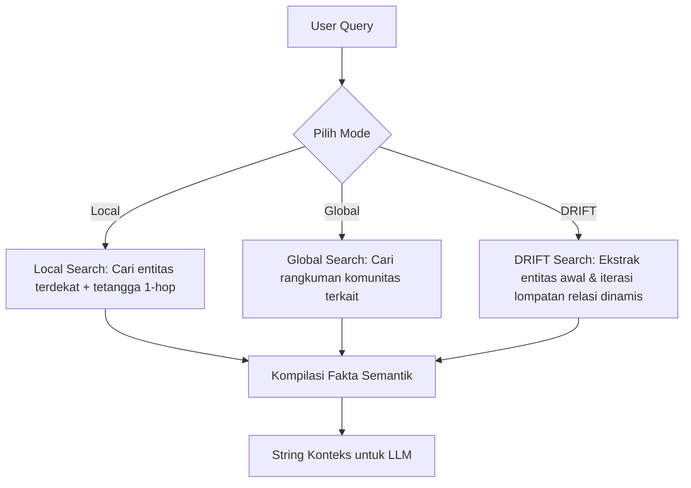

# Dokumentasi Fitur: GraphRAG Retrieval

## Overview
Modul `GraphRAG Retrieval` menyediakan sistem pencarian multi-metode untuk mengekstrak konteks semantik dari Neo4j guna melengkapi kueri pengguna sebelum dikirim ke LLM. Modul ini mendukung tiga skenario pencarian: **Local Search** (berfokus pada detail spesifik entitas dan tetangga langsung 1-hop), **Global Search** (berfokus pada tren makro menggunakan rangkuman komunitas graf), dan **DRIFT Search** (pencarian relasi iteratif multi-hop untuk menemukan fakta tersembunyi yang saling terkait).

## Flowchart



## Input → Process → Output
- **Input**: `query` (kueri bahasa alami user) dan `mode` (salah satu dari "local", "global", atau "drift").
- **Process**: 
  - **Local**: Mencari entitas yang cocok di graf, lalu mengambil properti node tersebut beserta seluruh node tetangga yang terhubung langsung (1-hop).
  - **Global**: Mencari node `Community` yang relevan, lalu memuat teks properti `summary` dari komunitas tersebut.
  - **DRIFT**: Melakukan langkah awal seperti Local Search, kemudian menggunakan model perantara untuk secara iteratif memilih relasi terkuat dari tetangga-tetangga tersebut, lalu melompat ke relasi berikutnya (multi-hop traversal) untuk mengekstrak detail tambahan.
- **Output**: String gabungan berisi fakta-fakta semantik terstruktur yang akan dijadikan sebagai konteks dasar bagi generator LLM.

## Kode Contoh
```python
# File: src/graph/retrieval/local.py, global_search.py, drift.py

class GraphRAGRetriever:
    def retrieve_context(self, query: str, mode: str = "local") -> str:
        """
        Parameter:
          query (str): Kueri pertanyaan dari pengguna.
          mode (str): Mode pencarian ("local" | "global" | "drift").
        
        Return:
          str: Gabungan teks konteks semantik dari database graf.
        """
        if mode == "local":
            return self.local_retriever.search(query)
        elif mode == "global":
            return self.global_retriever.search(query)
        elif mode == "drift":
            return self.drift_retriever.search(query)
        else:
            raise ValueError(f"Mode {mode} tidak didukung.")
```

## Catatan Penting
- **Local Search** sangat cocok untuk pertanyaan berorientasi mikro (fakta spesifik dari satu record EMR).
- **Global Search** sangat cocok untuk mendeteksi pola umum atau tren di seluruh dokumen karena menggunakan rangkuman komunitas.
- **DRIFT (Dynamic Relation Iteration for Fact Tracking)** memakan sumber daya komputasi LLM lebih besar karena melakukan panggilan API LLM iteratif untuk memilih "jalur lompatan" relasi terbaik.
