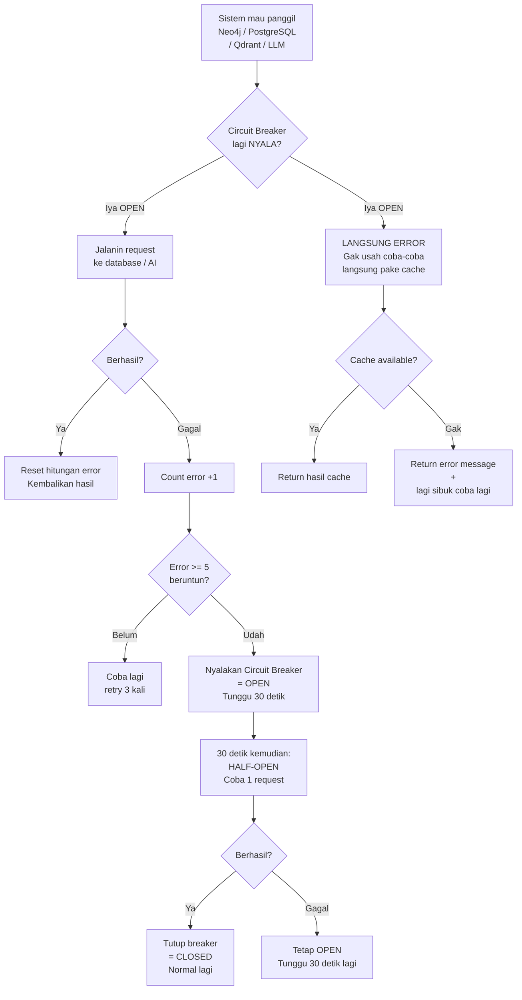
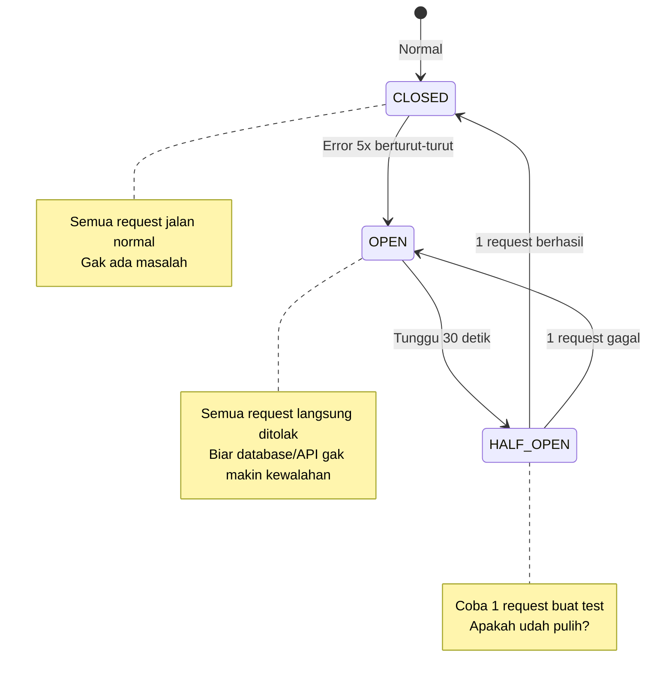

# Dokumentasi Fitur: Resilience (Circuit Breaker + Caching)

## Apa yang Dilakukan Fitur Ini?

Fitur ini tugasnya **ngejamin sistem tetep jalan meskipun ada masalah**.

Bayangin: database lagi sibuk, atau koneksi ke AI lagi lemot. Biasanya aplikasi bakal error atau timeout. Tapi dengan fitur resilience, sistem punya **jaring pengaman**:

1. **Circuit Breaker** — kayak sekring listrik. Kalau ada yang error terus, "mati" dulu sebentar biar gak bikin masalah makin parah
2. **Semantic Cache** — nyimpen jawaban pertanyaan yang mirip, jadi gak perlu tanya AI terus-terusan
3. **LLM Failover** — kalau Azure OpenAI error, otomatis pindah ke OpenAI biasa atau cadangan

## Alur Kerja (Flowchart)



## State Circuit Breaker



## Komponen Resilience

### 1. Circuit Breaker Per Service

Ada 4 circuit breaker, masing-masing buat service yang beda:

| Breaker | Buat | Efek Kalau OPEN |
|---------|------|-----------------|
| `neo4j_cb` | Neo4j (graf) | Query graf gagal, pake fallback |
| `postgres_cb` | PostgreSQL (SQL) | Query SQL gagal, pake fallback ILIKE |
| `qdrant_cb` | Qdrant (vector search) | Vector search gak jalan, pake fulltext aja |
| `cloud_llm_cb` | Azure OpenAI / OpenAI | Pindah ke failover LLM |

### 2. LLM Failover

Kalau Azure OpenAI utama error:
```
Azure OpenAI (primary) → Azure OpenAI (failover) → OpenAI (fallback)
```

Setiap level punya circuit breaker sendiri. Kalau semua gagal, sistem ngasih tau user "Layanan AI lagi bermasalah".

### 3. Semantic Cache

Cache ini nyimpen **jawaban dari pertanyaan yang mirip**.

Caranya:
1. Pertanyaan kamu diubah jadi **vector** (angka-angka yang merepresentasikan makna)
2. Vector dicari di Qdrant (vector database) — apakah ada pertanyaan mirip yang udah dijawab?
3. Kalau ada yang mirip (skor > 0.95) → jawaban lama dipake, gak perlu panggil AI lagi
4. Kalau gak ada → proses normal, jawaban disimpen buat nanti

### 4. Error Response

Kalau semua cadangan gagal, sistem tetep balas sopan:
```json
{
    "error": "Maaf, layanan sedang sibuk. Silakan coba lagi nanti.",
    "code": "SERVICE_UNAVAILABLE"
}
```

## Input → Proses → Output (Dari Sisi User)

**Normal:** User gak ngerasa beda. Sistem jalan kayak biasa.

**Database error:** User tetep dapet jawaban, mungkin lebih lambat sedikit karena pake cadangan.

**LLM error:** User dapet jawaban dari cache (kalau ada pertanyaan mirip). Atau dapet error yang sopan.

**Semua error:** User dapet pesan yang sopan, gak bakal liat stack trace atau error teknis.

## Kode Contoh (Simplified)

```python
# File: src/services/resilience.py

class CircuitBreaker:
    """Kayak sekring: matiin sementara kalau error terus."""
    
    def __init__(self, threshold=5, recovery_timeout=30):
        self.threshold = threshold      # Berapa kali error sebelum mati
        self.recovery_timeout = 30      # Detik sebelum coba lagi
        self.failures = 0
        self.state = "CLOSED"           # CLOSED = normal, OPEN = mati
    
    def call(self, func, *args):
        if self.state == "OPEN":
            if time_since_last_try() > self.recovery_timeout:
                self.state = "HALF_OPEN"
            else:
                raise BreakerOpenError()
        
        try:
            result = func(*args)
            self.failures = 0
            self.state = "CLOSED"
            return result
        except Exception:
            self.failures += 1
            if self.failures >= self.threshold:
                self.state = "OPEN"     # MATI!
            raise
```

```python
# File: src/services/cache_service.py

class SemanticCache:
    """Nyimpen jawaban pertanyaan mirip."""
    
    def get(self, query: str) -> str | None:
        # Ubah query ke vector
        vector = embedding_service.embed(query)
        # Cari di Qdrant: adakah pertanyaan mirip?
        similar = qdrant_service.search(vector, threshold=0.95)
        if similar:
            return similar.answer  # Pake jawaban lama!
        return None
    
    def set(self, query: str, answer: str):
        # Simpen jawaban ke Qdrant + Redis
        vector = embedding_service.embed(query)
        qdrant_service.save(vector, query, answer)
        redis_service.set(query, answer, ttl=3600)
```

## Catatan Penting untuk Pengembang Selanjutnya

1. **Circuit breaker itu thread-safe.** Artinya aman dipake barengan sama banyak user. Gak bakal ada race condition.

2. **HTTP 429 (Too Many Requests) TIDAK ngetrip breaker.** 429 itu bukan error server, tapi sinyal "lagi kecepatan, pelan-pelan". Yang ngetrip breaker cuma error 5xx (server error).

3. **Cache disimpen di 2 tempat:** Qdrant (buat semantic search — cari pertanyaan mirip) + Redis (buat exact match — pertanyaan persis sama). Redis lebih cepet, Qdrant lebih fleksibel.

4. **TTL cache 1 jam.** Jadi kalau ada jawaban yang udah 1 jam, bakal dicari ulang. Ini biar data tetep segar.

5. **Cache bisa dihapus manual.** Ada endpoint `/cache/clear` di API. Berguna kalau abis update data dan pengen mastiin jawabannya fresh.

6. **Kalau mau observable: set OTEL_ENABLED=true.** Ini bakal ngirim tracing ke OpenTelemetry collector. Berguna buat debug dan monitoring.
