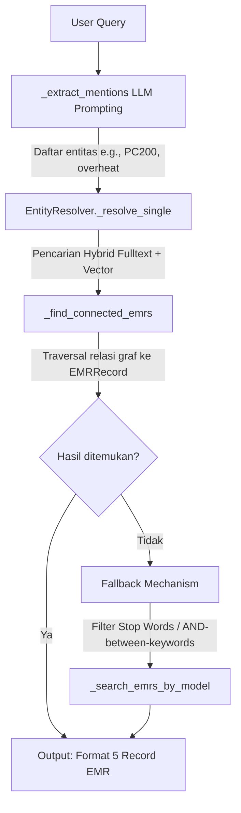

# Dokumentasi Fitur: search_emr_records

## Overview
Fitur `search_emr_records` dirancang untuk mencari dan menampilkan detail spesifik dari rekam jejak perawatan alat berat (EMR) langsung dari database graf (Neo4j) berdasarkan kueri bahasa alami. Sistem ini akan membongkar pertanyaan pengguna menjadi entitas-entitas teknis, memetakan entitas tersebut ke node di dalam Neo4j, dan melakukan penelusuran relasi (graph traversal) untuk mengambil maksimal 5 record EMR yang paling relevan.

## Flowchart



## Input → Process → Output
- **Input**: `query` berupa string bahasa alami dari pengguna (contoh: "Tampilkan detail EMR tentang kebocoran oli di final drive").
- **Process**: Kueri diteruskan ke LLM untuk ekstraksi entitas. Entitas yang didapat di-resolve ke database Neo4j. Sistem mencari node EMR yang terhubung dengan entitas tersebut. Pencarian model spesifik menggunakan operator `CONTAINS` pada properti, bukan relasi `MENTIONS`. Parameter khusus seperti `part_suply` dikecualikan dari konversi huruf kecil (`toLower()`).
- **Output**: String berformat Markdown yang berisi maksimal 5 detail record EMR lengkap dengan metadata dan riwayat kerusakan.

## Kode Contoh
```python
# File: src/agent/tools.py

def search_emr_records(query: str) -> str:
    """
    Parameter:
      query (str): Pertanyaan analitik atau pencarian EMR dari user.
    
    Return:
      str: Teks hasil kompilasi maksimal 5 record EMR yang cocok.
    """
    resolver = EntityResolver(graph_client)
    emrs = resolver.search_emr_records(query, limit=5)
    
    if not emrs:
        return "Tidak ada record EMR yang cocok dengan kueri tersebut."
        
    return format_emr_list_to_string(emrs)
```

## Catatan Penting
- Fitur ini murni melakukan penelusuran kualitatif graf (Node ke Node), tidak menggunakan SQL agregasi.
- Mekanisme pencocokan model alat berat dilakukan menggunakan properti `machine_model CONTAINS` karena keterbatasan relasi langsung.
- Variabel atau kata kunci `part_suply` harus dieksklusikan dari konversi *lowercase* (`toLower()`) agar pencarian *part number* tetap akurat.
